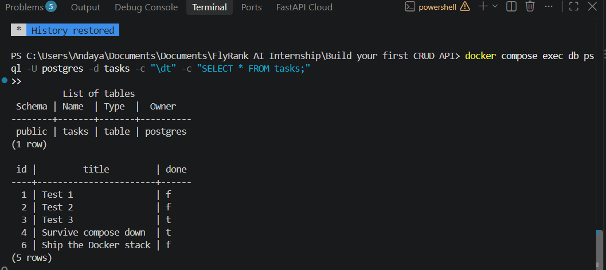

# Task CRUD API

A small FastAPI service for creating, reading, updating, and deleting tasks,
backed by a PostgreSQL database. The API and the database each run in their own
Docker container, and one command starts both.

This is the third storage engine behind the same API. The endpoints, the JSON
shapes, and the status codes have not changed along the way:

| Version | Where tasks live | What keeps them |
| --- | --- | --- |
| A1 | A Python list in memory | Nothing — gone on restart |
| A2 | A SQLite file, `tasks.db` | The file on disk |
| A3 (this one) | Rows in PostgreSQL | A Docker volume |

## Run it

You need [Docker Desktop](https://www.docker.com/products/docker-desktop/) (or
Podman) and nothing else — no Python, no Postgres install.

```bash
cp .env.example .env
docker compose up --build
```

The first start builds the API image, downloads Postgres, creates the `tasks`
table, and inserts three example tasks. Then:

- API: <http://localhost:8000/tasks>
- Interactive docs (Swagger UI): <http://localhost:8000/docs>

Stop everything with `docker compose down`. Your tasks are kept; see
[Persistence](#persistence).

## Configuration

Settings come from a `.env` file, which Git ignores so that no password is ever
committed. [`.env.example`](.env.example) lists every key with a placeholder
value, and those placeholders work as-is for local use.

| Variable | Used by | Purpose |
| --- | --- | --- |
| `POSTGRES_USER` | Compose | Database user created on the first start |
| `POSTGRES_PASSWORD` | Compose | That user's password |
| `POSTGRES_DB` | Compose | Database name, `tasks` |
| `DATABASE_URL` | The API, run outside Docker | Full connection string to `localhost:5433` |

Inside Docker you do not set `DATABASE_URL` yourself. [`compose.yaml`](compose.yaml)
builds it from the three `POSTGRES_*` values and points it at the host `db`,
which is the database service's name on the network Compose creates.

The password is only applied the first time the database volume is created.
Changing it later in `.env` does not change it inside an existing database.

## How it is put together

| File | Role |
| --- | --- |
| [`main.py`](main.py) | Routes, request validation, and status codes. Unchanged since A1 apart from startup. |
| [`db.py`](db.py) | The only file that talks to the database: connecting, creating the table, seeding it, and the five queries. |
| [`Dockerfile`](Dockerfile) | Builds the API image from `python:3.12-slim`. |
| [`compose.yaml`](compose.yaml) | Starts two services, `api` and `db`, plus the `taskdata` volume. |
| [`requirements.txt`](requirements.txt) | The four direct dependencies, pinned. |

Every query that takes user input uses `%s` placeholders and passes the values
separately, so nothing from a request is ever glued into SQL text.

On startup the API creates the `tasks` table if it is missing, then inserts the
three example tasks only when the table is empty. Restarting never duplicates
them.

| Column | Type | Notes |
| --- | --- | --- |
| `id` | `SERIAL` | Primary key. Postgres assigns it and never reuses a number. |
| `title` | `TEXT` | Required, never empty. |
| `done` | `BOOLEAN` | Defaults to `false`. |

## Endpoints

| Method | Endpoint | Description | Success | Errors |
| --- | --- | --- | --- | --- |
| GET | `/` | API name, version, and endpoints | `200` | — |
| GET | `/health` | Whether the API is running | `200` | — |
| GET | `/tasks` | List all tasks, ordered by id | `200` | — |
| GET | `/tasks/{id}` | Get one task | `200` | `404` |
| POST | `/tasks` | Create a task from `{"title": "..."}` | `201` | `400` |
| PUT | `/tasks/{id}` | Change `title` and/or `done` | `200` | `400`, `404` |
| DELETE | `/tasks/{id}` | Delete a task | `204`, empty body | `404` |

Every error response is JSON with an `error` key, for example
`{"error": "Task 999 not found"}`.

## Example

```bash
curl -i -X POST http://localhost:8000/tasks -H "Content-Type: application/json" -d '{"title":"Ship the Docker stack"}'
```

```text
HTTP/1.1 201 Created
server: uvicorn
content-length: 53
content-type: application/json

{"id":6,"title":"Ship the Docker stack","done":false}
```

On Windows PowerShell, use `curl.exe` and escape the inner quotes:
`-d "{\"title\":\"Ship the Docker stack\"}"`.

## Persistence

A container loses everything it wrote the moment it is removed. The database
files therefore live in a named volume, `taskdata`, which exists outside the
containers:

```bash
docker compose down     # removes both containers and their network
docker compose up       # creates fresh containers
curl http://localhost:8000/tasks   # every task is still there
```

`docker compose down -v` also deletes the volume, and with it every task. Use it
only when you want to start over from the three example tasks.

## Looking inside the database

Open a SQL prompt inside the running database container:

```bash
docker compose exec db psql -U postgres -d tasks
```

`\dt` lists the tables, `SELECT * FROM tasks;` shows the rows the API serves,
and `\q` exits.



A graphical client such as DBeaver or pgAdmin can connect too: host `localhost`,
port `5433`, and the user, password, and database from your `.env`.

## Running the API outside Docker

Useful while editing code, because the server reloads on every save. Start only
the database, then run the API from a virtual environment:

```bash
docker compose up -d db
python -m venv .venv
.venv/Scripts/activate        # macOS/Linux: source .venv/bin/activate
pip install -r requirements.txt
uvicorn main:app --reload
```

This uses `DATABASE_URL` from `.env`, which points at `localhost:5433`.

## Troubleshooting

**`password authentication failed for user "postgres"` when running outside
Docker.** Another PostgreSQL, installed directly on the machine, is answering on
that port. That is why this project publishes the database on 5433 instead of
the usual 5432. Check that `DATABASE_URL` in `.env` uses port 5433.

**`CERTIFICATE_VERIFY_FAILED` during `docker compose up --build`.** Some
antivirus products (AVG and Avast among them) decrypt HTTPS traffic and re-sign
it with their own certificate. Windows trusts that certificate but the Linux
image does not, so `pip install` fails inside the build. Add `pypi.org` and
`files.pythonhosted.org` to the antivirus's HTTPS scanning exceptions.

**The database container exits right after starting.** Postgres 18 images
expect the volume mounted at `/var/lib/postgresql`. Guides written for earlier
versions mount it at `/var/lib/postgresql/data`, which Postgres 18 refuses.

## Earlier versions

The SQLite version (A2) is in the Git history. Its notes are kept in
[docs/sql-notes.md](docs/sql-notes.md), with a screenshot of
[its database in DB Browser for SQLite](docs/db-browser-tasks-table.png).


